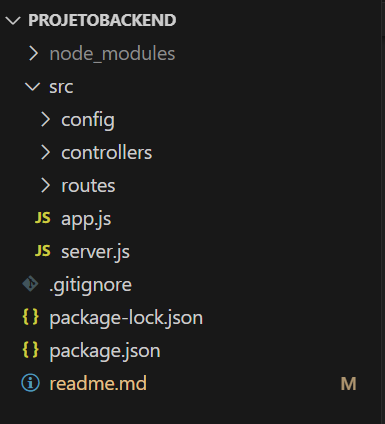
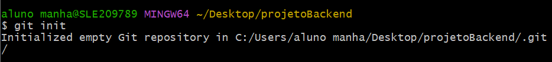
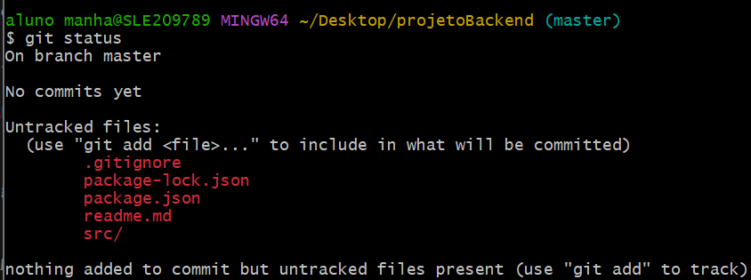

# Documentação API Node_js

## Passo a passo:

**Criar pasta:**
```
mkdir NOME_DA_PASTA
```
* mkdir serve para criar uma nova pasta

**Entrar na pasta:**
```
cd NOME_DA_PASTA
```
* cd serve para entrar na pasta selecionada:

**Abrir VSCode:**
```
code .
```

**Iniciar o gerenciador de pacotes:**
```
npm init -y
```

**Instalar os pacotes:**
```
npm i express nodemon dotenv
```
* **express:** Framework web para construção da estrutura da API;
* **nodemon:** Monitora as mudanças nos arquivos do projeto e reinicia de forma automática o servidro Node;
* **dotenv**: Gerencia as váriaveis do ambiente dentro do projeto.

**Criar arquivo do .gitignore:**
```
touch .gitignore
```
<sup> Adicionar a pasta node_modules no arquivo .gitignore </sup>
* touch cria um arquivo vazio.
```
nano .gitignore
```

* **nano** cria um arquivo vazio editável pelo terminal.
* **Ctrl + O:** Salvar arquivo;
* **Enter:** Confirmar;
* **Ctrl + X:** Fechar arquivo.

**Criar estrutura de pastas e arquivos:**
```
mkdir src
```

**Criar arquivos dentro da pasta src:**
```
touch src/app.js
```
* Arquivo resposável de criar a configuração da API.
```
touch src/server.js
```
* Arquivo responsável em receber as configurações da aplicação e rodar a API.

**Criar pastas dentro da pasta src:**
```
mkdir src/config
```
* Pasta para gerenciar a conexão com o banco de dados.
 
```
mkdir src/controllers
```
* Pasta para gerenciar as requisições das rotas e conexão com banco de dados.

```
mkdir src/routes
```
* Pasta para gerencias as rotas da API.

**Verificar a estrutura do projeto:**
* Conferir se a pasta do projeto esta igual a imagem:


**Enviar a estrutura do projeto para o gitHub**
* Inicializar o gerenciador de arquivo .git
```
git init
```


* Informar o nome e email:
```
git config --global user.name "FIRST_NAME"
```
<sup>FIRST_NAME = Nome</sup>

```
 git config --global user.email "EMAIL@EXAMPLE.COM"
```
<sup>EMAIL@EXAMPLE.COM = Email</sup>

* Verificar arquivos que serão enviados ao gitHub:
```
git status
```


* Adicionar todos os arquivos ao versionamento:
```
git add .
```

* Salvar projeto e escrever comentário sobre o processo realizado:
```
git commit -m 'COMENTÁRIO'
```
<sup>Adicionar o comentário entre aspas</sup>

* Criar um novo repositório no gitHub;
* Copiar o link (URL) do repositório;
___

* Definir a branch main:
```
git branch -M main
```

* Informar o repositório para ser enviado e colar a URL copiada:
```
git remote add origin URL_REPOSITÓRIO
```

* Enviar para o gitHub:
```
git push -u origin main
```
___

**Remover os arquivos da máquina**

* Verificar se todos arquivos estão no gitHub;
* Remover da máquina:
```
cd ..
```
<sup>Comando para acessar uma pasta anterior<sup>

* Fechar o VSCode com o projeto aberto.
___

```
rm -rf NOME_DA_PASTA_PROJETO
```
* **rm (remove):** Apaga o arquivo;
* **-r (recursive):** Apaga pastas e subpastas de forma recursiva;
* **-f (force):** Não pergunta confirmações;
* **NOME_DA_PASTA_PROJETO:** Nome da pasta que contém os arquivos da aplicação.